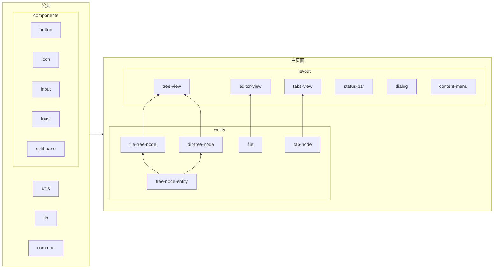

# willow-editor
> 部分功能需要开启 chrome 开启实验性功能 Experimental Web Platform features
## 介绍
willow-editor 是一个在线本地文件编辑器

地址: https://leolun.github.io/willow-editor/

支持
- [x] 打开本地文件夹
- [x] 新建文件/文件夹
- [x] 删除文件/文件夹
- [x] 文件重命名（需要开启 chrome 开启实验性功能 Experimental Web Platform features）
- [] 文件夹重命名（暂无 API 支持）
## 开发
基于 vite + vue3 + less + monaco-editor 开发

文件操作依赖 [File System Access API](https://developer.mozilla.org/en-US/docs/Web/API/File_System_Access_API)

其中文件重命名操作依赖 chrome 的非标准 [API提案](https://github.com/whatwg/fs/pull/10)；所以只有在chrome 上并且开启实验性功能才能使用

### 运行
1. 安装依赖
```shell
npm i
```
2. 运行
```shell
npm run dev
```
3. 打开 http://localhost:5173/willow-editor/
### 模块划分


